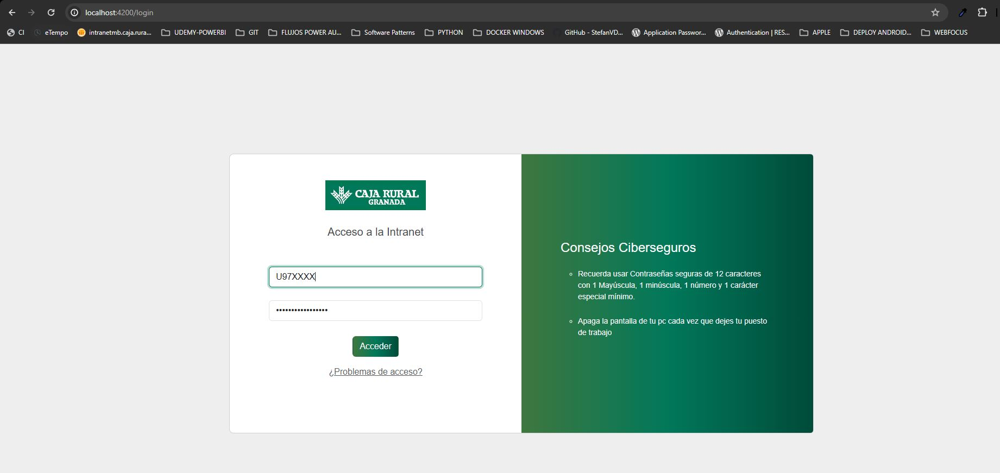
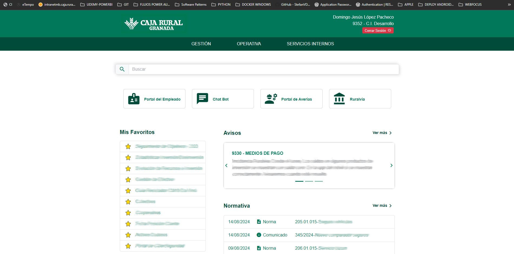
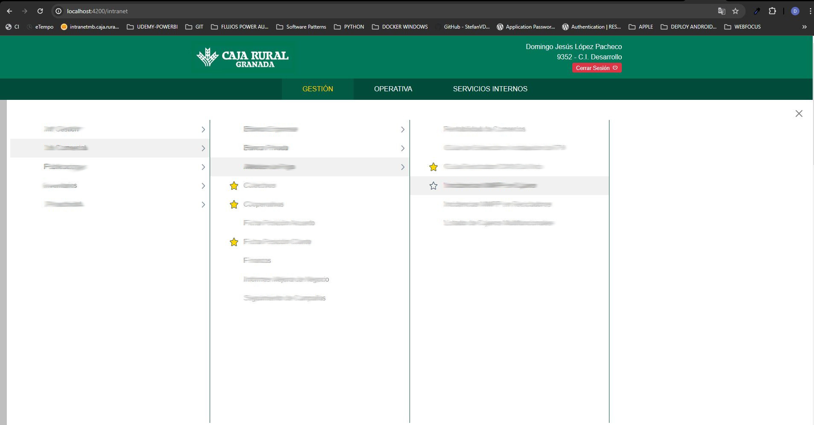
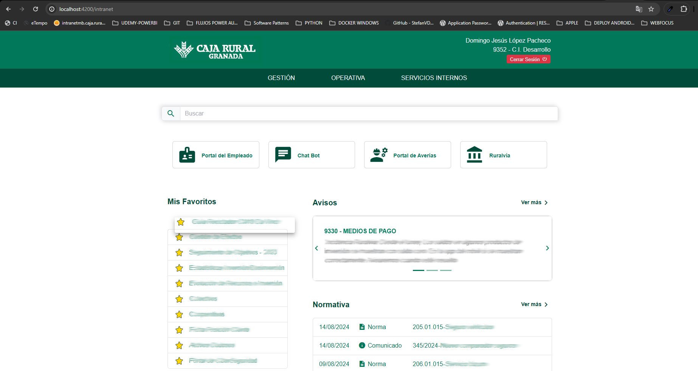
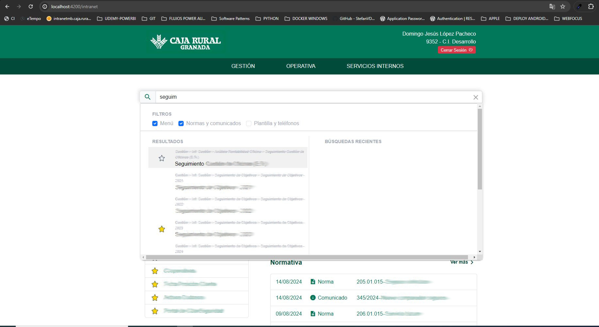

## Prototipo Intranet CRG. 

Prototipo de Intranet FastApi y Angular para obtención de menús, favoritos, normativa, y demás elementos de la Intranet CRG.

### Funcionalidades:
- Login contra Active Directory.
- Sesiones y Autenticación con JWT.
- Menús recursivos gestionables desde aplicación interna. Cada elemento redirige a aplicaciones internas desarrolladas en distintas tecnologías y servidores como Webfocus, php (Apache) o NodeJs
- Favoritos y posicionamiento de los mismos.
- Búsqueda inteligente con texto predictivo y seleccionables varios.  
 

### Capturas de pantalla:   

